# Rashbase Studio

A free, AI-native database client. Tauri v2, React 19, Rust.

Source-available under the [PolyForm Noncommercial 1.0.0](LICENSE) licence: read
it, fork it, change it, use it for anything noncommercial. Commercial use — including
shipping it, or anything derived from it, as part of a product — is not granted.

See [PRODUCT.md](PRODUCT.md) for what this is and [DESIGN.md](DESIGN.md) for the
design system.

## Screenshots

<table>
  <tr>
    <td colspan="2" align="center">
      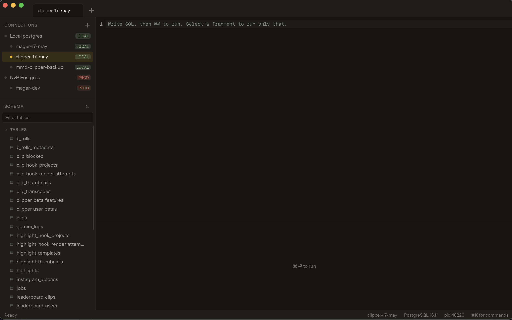
      <br>
      <sub><b>Connections and editor.</b> Grouped by environment, so a <code>PROD</code> connection never looks like a local one.</sub>
    </td>
  </tr>
  <tr>
    <td align="center" width="50%">
      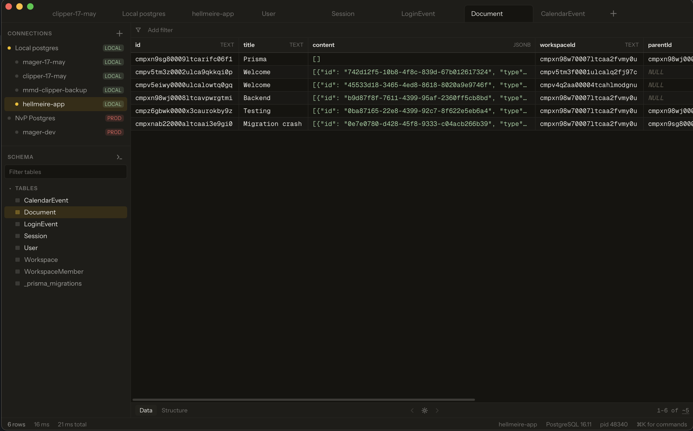
      <br>
      <sub><b>Result grid.</b> Virtualized, column types in the header, row count and timings in the footer.</sub>
    </td>
    <td align="center" width="50%">
      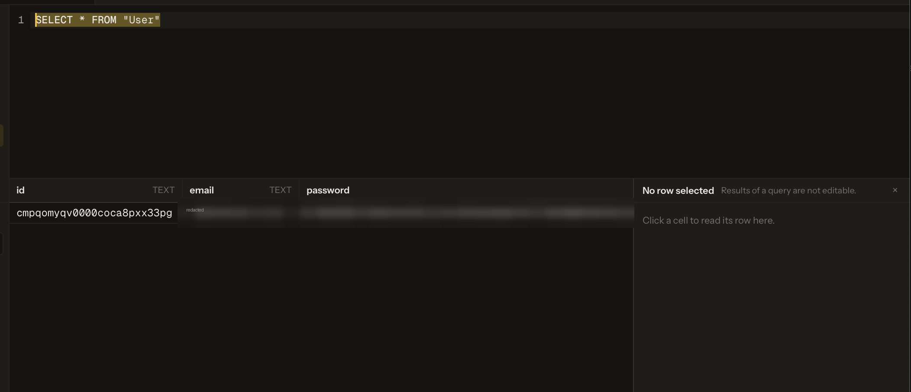
      <br>
      <sub><b>Query results.</b> Same grid, but not editable — the panel says so rather than failing on save.</sub>
    </td>
  </tr>
  <tr>
    <td align="center" width="50%">
      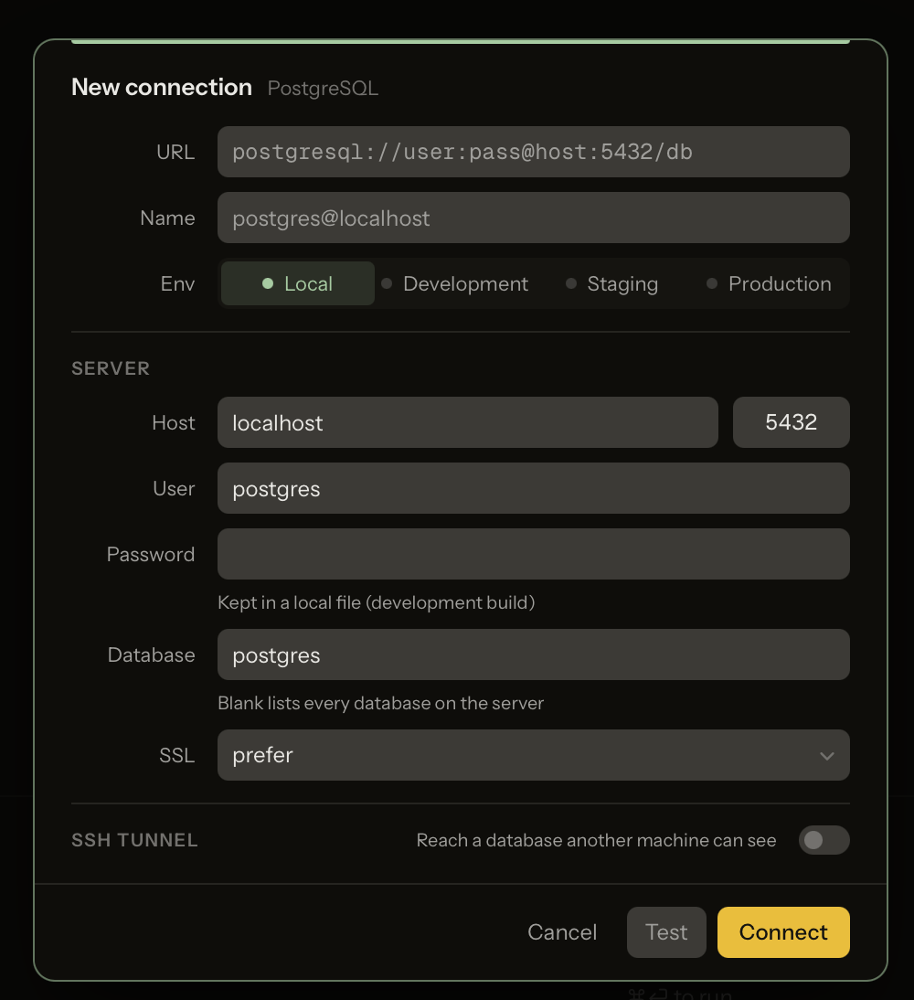
      <br>
      <sub><b>New connection.</b> Paste a URL or fill the form. A blank database lists every one the role can open.</sub>
    </td>
    <td align="center" width="50%">
      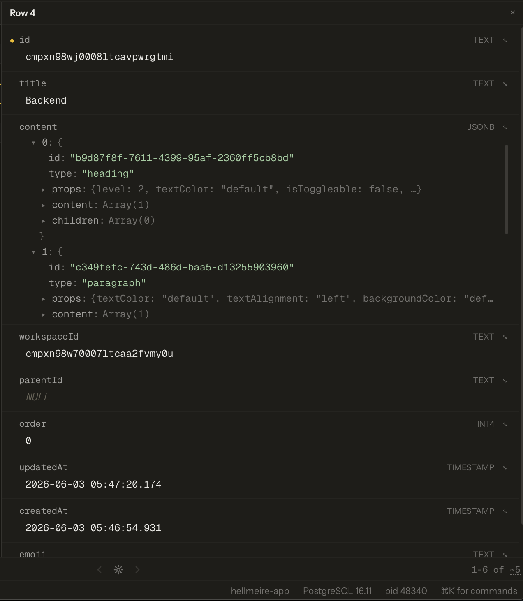
      <br>
      <sub><b>Row detail.</b> One row at full width, JSONB expanded in place.</sub>
    </td>
  </tr>
  <tr>
    <td colspan="2" align="center">
      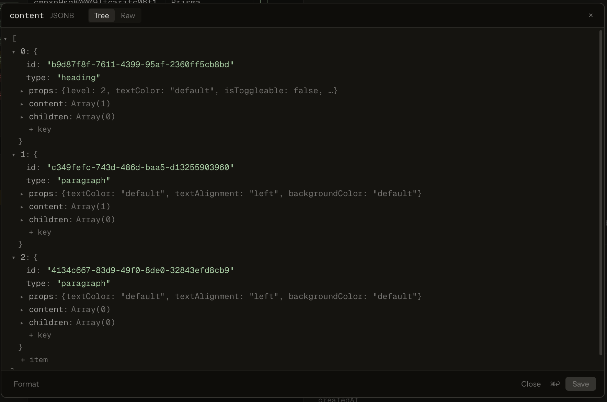
      <br>
      <sub><b>JSON viewer.</b> A JSONB cell on its own, as a tree or as raw text.</sub>
    </td>
  </tr>
</table>

### Redis

The same grid, the same row panel, the same JSON viewer. A page of keys is
converted into the result the grid already draws, so nothing about these
surfaces is a second implementation.

<table>
  <tr>
    <td colspan="2" align="center">
      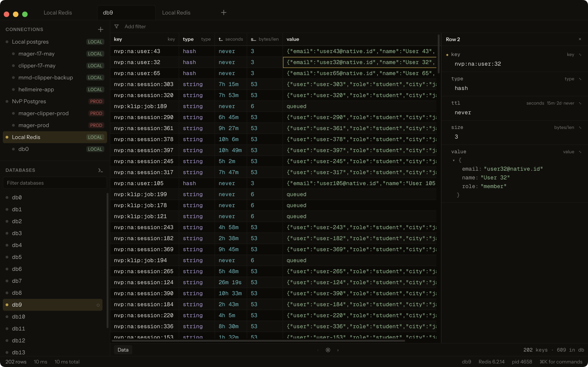
      <br>
      <sub><b>Keyspace.</b> <code>key · type · ttl · size · value</code>. TTL reads as a duration, not as the <code>-1</code> Redis returns, and a hash opens in the same JSON tree a JSONB column uses.</sub>
    </td>
  </tr>
  <tr>
    <td colspan="2" align="center">
      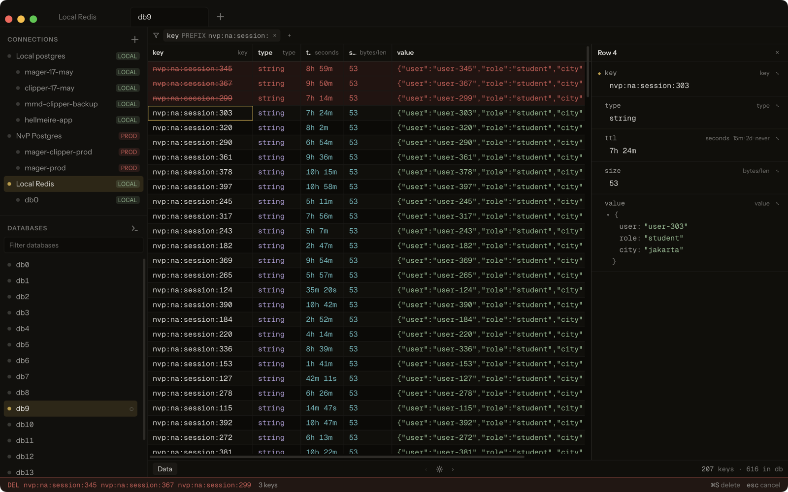
      <br>
      <sub><b>Staged deletion.</b> <code>Delete</code> marks a row and moves the caret on, so marking several is one gesture. The red rows and the command in the status bar are the confirmation; <code>⌘S</code> runs it, <code>Esc</code> calls it off.</sub>
    </td>
  </tr>
  <tr>
    <td align="center" width="50%">
      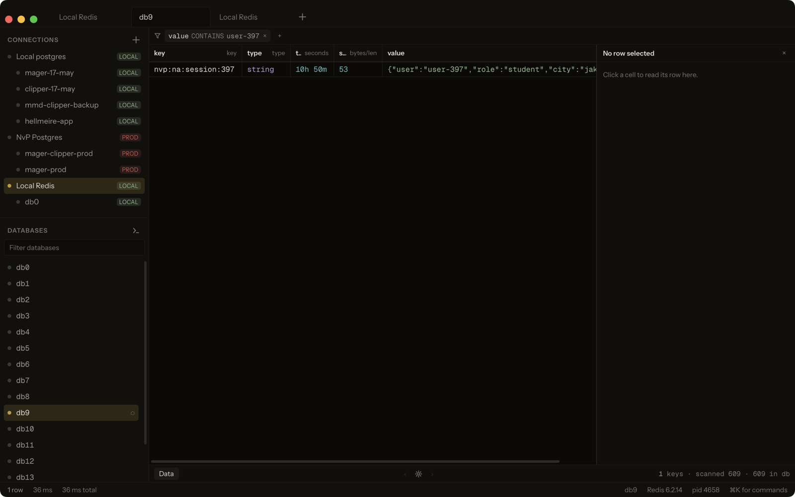
      <br>
      <sub><b>Honest filtering.</b> One key matched, and the footer says it walked 609 to find it. A key glob is pushed to the server; a value search is not, and hiding that would be a lie about what the page cost.</sub>
    </td>
    <td align="center" width="50%">
      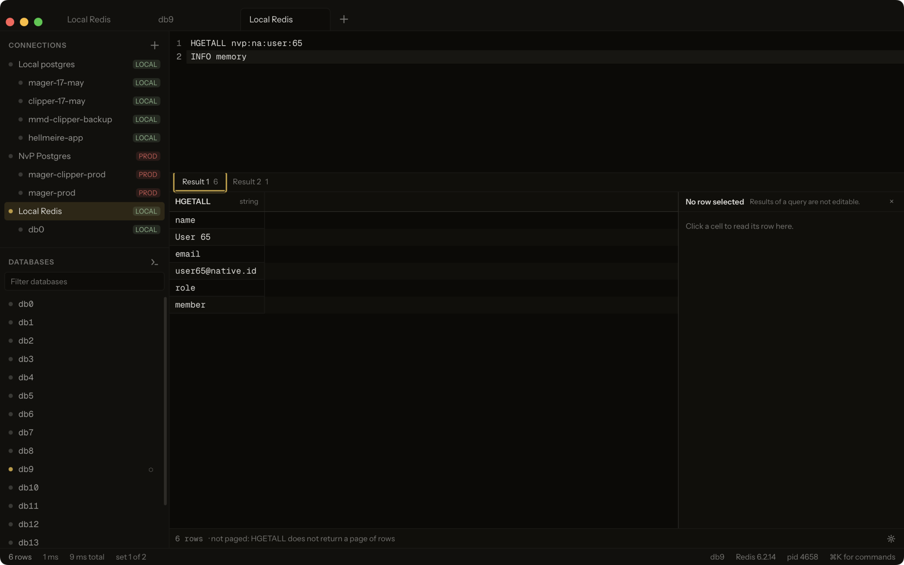
      <br>
      <sub><b>Command console.</b> <code>⌘T</code> on a Redis connection. One command per line, one result set each, quotes honoured the way <code>redis-cli</code> honours them.</sub>
    </td>
  </tr>
  <tr>
    <td colspan="2" align="center">
      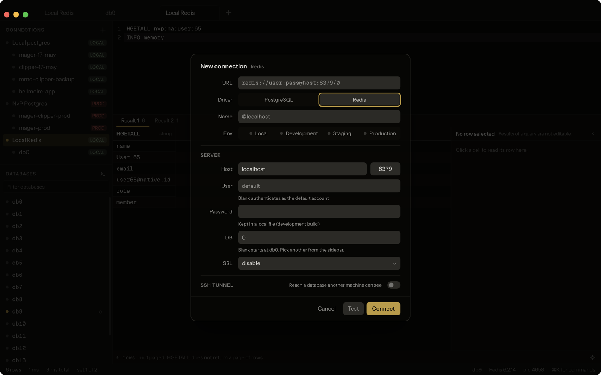
      <br>
      <sub><b>One sheet, both drivers.</b> Picking Redis moves the port, renames <em>Database</em> to <em>DB</em>, drops the SSL modes that cannot mean anything here, and leaves everything you already typed about <em>where</em> the server is.</sub>
    </td>
  </tr>
</table>

## Database support

| Database | Status |
| --- | --- |
| PostgreSQL | Supported |
| Redis | Supported |

Redis is a key-value store, not a relational one, so it answers a different set
of questions: a flat keyspace instead of schemas and tables, a glob instead of a
`where` clause, and no SQL. What it does and does not do is in
[Browsing a keyspace](#browsing-a-keyspace).

Not supported yet. Each needs a driver under `src-tauri/src/drivers/`; see
[Adding a database](#adding-a-database).

- MySQL / MariaDB
- SQLite
- Microsoft SQL Server
- CockroachDB
- ClickHouse
- DuckDB
- MongoDB

Postgres-wire-compatible servers (Supabase, Neon, Timescale, Yugabyte) connect
through the PostgreSQL driver, but nothing specific to them is handled.
Redis-protocol servers (Valkey, KeyDB, Dragonfly) connect through the Redis
driver on the same terms.

## Install

Prebuilt installers for every tagged release are on the
[releases page](https://github.com/native-productions/rashbase-studio/releases).
The scripts below pick the right artifact for your platform and install it.

**macOS and Linux**

```sh
curl -fsSL https://raw.githubusercontent.com/native-productions/rashbase-studio/main/scripts/install.sh | bash
```

macOS gets the `.dmg` for your architecture copied into `/Applications`. Linux
gets the `.deb` or `.rpm` if your distro uses one, and the `.AppImage`
otherwise.

**Windows**

```powershell
irm https://raw.githubusercontent.com/native-productions/rashbase-studio/main/scripts/install.ps1 | iex
```

Runs the NSIS installer. Pass `-Installer msi` to the script for the MSI
instead.

### These builds are not signed

There is no Apple Developer or Windows code-signing certificate yet, so both
operating systems warn you the first time you open the app. The install scripts
above handle macOS for you. If you downloaded an installer by hand instead:

- **macOS** quarantines the app and refuses to launch it ("damaged and can't be
  opened"). Clear the flag once, after moving the app into `/Applications`:

  ```sh
  xattr -dr com.apple.quarantine "/Applications/Rashbase Studio.app"
  ```

- **Windows** shows a SmartScreen prompt ("Windows protected your PC"). Click
  **More info**, then **Run anyway**.

- **Linux** does not warn; there is nothing to do.

## Requirements

- [Bun](https://bun.sh)
- Rust stable
- Xcode Command Line Tools (macOS)

## Development

```sh
bun install
bun run tauri dev
```

## Build

```sh
bun run tauri build
```

## Releasing

```sh
./scripts/release.sh 0.2.0                  # all platforms
./scripts/release.sh 0.2.0 linux,windows    # only those two
./scripts/release.sh 0.2.0 macos --dry-run  # show the bump, change nothing
```

Platforms are `macos` (builds both Apple Silicon and Intel), `windows`, and
`linux`; the default is all three.

The script bumps the version in `package.json`, `src-tauri/tauri.conf.json` and
`src-tauri/Cargo.toml`, pushes a `v0.2.0` tag, then triggers the
[release workflow](.github/workflows/release.yml) with `gh workflow run`. The
workflow builds the selected platforms and attaches the artifacts to a **draft**
release. Review the draft on GitHub, then publish it.

Requires the [GitHub CLI](https://cli.github.com) to be installed and
authenticated. The workflow is dispatch-only — pushing a tag by hand does not
build anything, because a push trigger would fire a second, unfiltered build for
the same tag.

If one platform fails, re-run just that leg against the tag that already exists.
`release.sh` refuses to reuse a tag, so dispatch the workflow directly; the new
artifacts are added to the same draft release:

```sh
gh workflow run release.yml -f tag=v0.2.0 -f platforms=windows
```

## Tests

```sh
bun test                   # frontend, in src/__tests__/
cd src-tauri && cargo test # backend
```

Two Redis suites need a real server and are skipped without one. They cover
what unit tests cannot reach.

`redis_keyspace` checks that the cursor walk visits every key exactly once, that
a value search matching nothing stops on its budget and reports honestly, that
writes read back, and that a key whose name holds a space survives being
deleted. It begins with `FLUSHDB`, so point it at a database you do not mind
losing, and run it single-threaded — its cases share one database.

`bull_retry` checks that a retry does what BullMQ's own retry does: the failed
reason cleared, the marker set so a blocked worker wakes, a second retry of the
same job refused rather than queued twice, `attemptsMade` kept unless the reset
was asked for, `lifo` putting the job on the end that runs next, and a job
belonging to a flow put back among its parent's dependencies. It flushes
nothing — every key it writes is under its own prefix and it deletes exactly
those — so it takes its own database only to stay clear of the other suite's
`FLUSHDB`.

```sh
docker run -d -p 6379:6379 redis:7
cd src-tauri

RASHBASE_REDIS_HOST=127.0.0.1 RASHBASE_REDIS_DB=12 \
  cargo test --test redis_keyspace -- --test-threads=1 --nocapture

RASHBASE_REDIS_HOST=127.0.0.1 RASHBASE_REDIS_BULL_DB=10 \
  cargo test --test bull_retry -- --nocapture
```

It seeds its own fixture, which means it starts with `FLUSHDB`. It refuses to
run against a database holding any key it did not write, so pointing
`RASHBASE_REDIS_DB` (default `9`) at a database with real data in it fails
loudly instead of destroying it. `RASHBASE_REDIS_FORCE=1` says it on purpose.

The performance gate needs a real Postgres and is skipped without one:

```sh
cd src-tauri
RASHBASE_PG_PASSWORD=... cargo test --test perf_gate --release -- --nocapture
```

It seeds nothing. Create the fixture first:

```sql
create table perf_test (
  id bigserial primary key, uid uuid not null default gen_random_uuid(),
  email text not null, full_name text, score numeric(10,2),
  attempts integer not null, ratio double precision, is_active boolean not null,
  created_at timestamptz not null, expires_on date, payload jsonb, tags text[]
);
insert into perf_test (email, full_name, score, attempts, ratio, is_active, created_at, expires_on, payload, tags)
select 'user' || g || '@example.com',
       case when g % 17 = 0 then null else 'Person Number ' || g end,
       round((random() * 10000)::numeric, 2), (random() * 500)::int, random(),
       g % 3 = 0, now() - (g || ' minutes')::interval,
       case when g % 11 = 0 then null else (now() + (g || ' days')::interval)::date end,
       jsonb_build_object('n', g, 'bucket', g % 7),
       array['tag' || (g % 5), 'group' || (g % 3)]
from generate_series(1, 100000) g;
```

## Architecture

```
src/                     React 19 + TypeScript
  __tests__/             Every frontend test
  lib/types.ts           Every shape the app passes around
  lib/ipc.ts             Typed wrappers over the Tauri command surface
  lib/constants/         Lookup tables, class strings, shared metrics
  lib/utils/             Pure functions: SQL builders, filters, row identity
  lib/utils/redis.ts     A key page as a QueryResult, so the grid needs no changes
  lib/commands.ts        Command registry: one source for hotkeys and palette
  lib/hotkeys.ts         Single keydown listener resolving against the registry
  components/grid/       Virtualized result grid
  components/editor/     CodeMirror 6 SQL editor
  store/app.ts           Zustand state

src-tauri/src/
  commands/              IPC surface, split by concern
  drivers/
    mod.rs               Driver and Session traits, Capabilities
    types.rs             Wire types every driver speaks
    registry.rs          Driver registry and open sessions
    postgres/            The PostgreSQL driver
    redis/               The Redis driver: keyspace walk, console, writes
      bull.rs            BullMQ read as a lens over that keyspace
      lua/               BullMQ's own scripts, vendored verbatim
  ssh.rs                 SSH tunnel, with known_hosts enforcement
  keychain.rs            OS keystore wrapper
  error.rs               One serializable error shape
```

### Adding a database

A driver is a folder under `src-tauri/src/drivers/` implementing `Driver` and
`Session`, plus one line in `DbState::default`. Every catalogue method on
`Session` defaults to refusing, so a driver only implements what its server
actually has — a key-value store has no schemas, and saying so is a valid
answer rather than a gap. `Capabilities` is how a driver states which of them
it means to answer.

Connections carry a `driver` field naming which one opens them. It defaults to
`postgres` when absent, so a `connections.json` written before drivers existed
keeps loading.

### Two query paths

**Reads** run user SQL over Postgres' *simple query protocol*
(`sqlx::raw_sql`). Multi-statement scripts and session commands (`SET`,
`BEGIN`) work as typed, and every value arrives in text format, so arrays,
enums, jsonb, ranges, and user-defined types decode without a per-OID table.
Verified by `tests/perf_gate.rs`.

**Writes** (the generated `UPDATE` behind inline cell editing) use bound
parameters over the extended protocol. The simple protocol is never used to
interpolate user data.

Every parameter is bound as text and cast in the statement, so one code path
carries every column type: `cast(text as <type>)` runs that type's own input
function, and `returning` casts back to text so the grid shows what Postgres
stored rather than what was typed. The row is identified by the table's own
primary key, read from `pg_catalog` backend-side; the frontend cannot compose a
`where` clause. Verified by `tests/write_path.rs`.

### Editor results are bounded two ways

A query tab keeps 1000 rows by default (a table page keeps 200). How that bound
is reached depends on the statement, because rewriting SQL a person typed is
only safe some of the time.

**Wrapped, when it can be.** A single read-only `SELECT` or `WITH` that sets no
limit of its own is run as `select * from (<statement>) _ limit n offset m`, so
the footer gets a real pager. `unpageableReason` in `lib/utils/statement.ts`
decides, working on a copy of the SQL with comments and literals masked out, and
refuses on anything it is not sure about — a script, a write (including a
data-modifying CTE, where paging would re-run the `DELETE` on every click), a
statement with its own `LIMIT`, `FOR UPDATE`, or `SELECT INTO`.

**Capped, otherwise.** The statement runs exactly as typed and the backend stops
keeping rows past `maxRows`. Rows past the cap are still read off the socket —
the stream has to reach `CommandComplete` for the connection to stay usable, and
that tag carries the true row count — but nothing is allocated for them. The
result reports `truncated`, and `rowsAffected` still says what the statement
really produced, so the footer reads "1,000 of 38,412" rather than pretending
there were 1,000.

The editor's own text is never rewritten either way.

### Browsing a keyspace

Redis has no schemas, no tables, and no SQL, so the driver answers almost every
catalogue method with the trait's refusing default. What it has instead is one
flat namespace per numbered database, reached through two methods a relational
driver never implements: `list_keys` and `delete_keys`.

**A page of keys is a `QueryResult`.** `keyPageToResult` in
`lib/utils/redis.ts` turns one page into the same five-column result the grid
already draws — `key · type · ttl · size · value`. That one function is why the
result grid, the row panel, the JSON viewer, the expanded cell editor and the
virtualizer needed no changes to browse Redis: nothing downstream of it knows
Redis exists.

**`SCAN`, never `KEYS`.** `KEYS *` blocks the server for as long as it takes to
walk every key, which on a production instance is a stall every other client
shares. The walk is cursor-based and bounded, and pages the way the server
pages — so Prev pops a stack of cursors rather than re-walking from the start.

**Filters cost different amounts, and say so.** A condition on the key becomes
the `MATCH` glob and is evaluated server-side for almost nothing. A condition on
the value can only be answered by reading every key the walk touches. A page of
12 keys can therefore cost a walk of 50,000, so the walk reports what it spent
and the footer shows it: `12 keys · scanned 50,000`. Without that the footer
would be claiming a completeness the scan never had.

**The walk is budgeted.** A value search that matches nothing would otherwise
walk ten million keys inside one IPC call and freeze the window. Hitting the
budget is not an error: the page returns with its cursor, and Next resumes
exactly where it stopped.

**Writes are strings and hash fields.** A string is `SET ... KEEPTTL` — editing
a value is not a decision about when it expires. A hash is written as a
document: the JSON the row panel handed back is diffed against what is stored,
and only the fields that actually changed move, which is what makes the existing
JSON editor a Redis editor without it learning a single Redis command. A list,
set, or sorted set has no single-cell equivalent, so those are read-only and say
which gesture to use instead.

**Deleting is staged, not immediate.** Select a row, press `Delete`, and it
turns red; the status bar prints the exact command (`DEL "user:1" "user:2" …`)
and `⌘S` runs it. The red rows plus that line are the confirmation, which is the
same bargain the pending `UPDATE` preview makes: PRODUCT.md asks that a
generated write be shown before it runs, and a dialog per key would make ten
deletions ten dialogs. `Esc` clears the marks. Keys travel as arguments and are
never spliced into a command string — a key is arbitrary bytes, and one holding
a space breaks anything built by joining names together.

**The query tab is a command console.** On a Redis connection `⌘T` opens a tab
that takes one command per line and shapes each reply into a result set, which
is the same thing the tab strip already does for a multi-statement SQL script.
Quotes are honoured the way `redis-cli` honours them, so `HSET k name "Dwi
Putra"` is four arguments and not five. Commands that never return
(`SUBSCRIBE`, `MONITOR`, `BLPOP`) are refused by name: this driver has no
`cancel`, so one of them would wedge the session with nothing to press.

### Tracing a BullMQ queue

BullMQ is not a database. It is a key layout one Node library writes into Redis,
so it lives beside the keyspace walk rather than as a third driver: the
connection, the credentials and the tunnel are already open, and asking for a
second connection to the same server to look at the same keys through a
different lens would be a tax rather than a feature. The Queues section appears
under the databases on any Redis connection, and only walks when it is opened —
finding queues means matching `<prefix>:*:meta` across the keyspace, which on an
instance holding millions of session keys is a real cost.

**The layout is a constant, so there is no layout code.** Every BullMQ queue has
the same lifecycle, so node positions are a table in `lib/constants/bullmq.ts`.
No dagre pass, no stored positions, no drag to persist, no "reset layout" — the
diagram cannot be rearranged because there is nothing about it to get wrong.
`prioritized` and `waiting-children` are drawn only when something is in them:
they exist for applications that use priorities or flows, and two empty boxes on
every other queue is noise in a surface whose whole job is to be glanced at.

**The beam is a measurement.** The rate on each edge is transitions per second
read off the queue's own event stream, not the difference between two polls of
the counts — that difference cannot tell a queue where fifty jobs went in and
fifty came out from a queue where nothing happened. An edge that saw nothing in
the last five seconds draws a still line, so a queue that has stopped looks
stopped. The rate is also printed as a number beside it, because speed alone
cannot separate four a second from four hundred.

`prev` is what makes this work: BullMQ names an event after the state the job
arrived in and carries the one it left in, so the pair is the edge. Without it a
retried job is indistinguishable from a newly added one, and a retry storm draws
as ordinary intake.

**The diagram is live, the rows are a snapshot, and the difference is stated.**
Polling, not push: once a second while the tab is `Live` and the window has
focus, so at most a second behind. That poll updates the counts, the rates, the
`paused` badge and the trace's event steps. It deliberately does *not* re-read
the job rows — pulling rows out from under a selection while someone is staging
a retry is the one thing this surface must not do.

So the page says how far behind it is. The count comes off the event stream
rather than from subtracting the live count from the page's own total: three
jobs failing while three others are retried leaves the total identical and the
page entirely out of date, and a net difference of zero is not evidence that
nothing happened. `⌘R` or the `⟳` beside the state re-reads, with the busy
indicator the rest of the app uses. The Queues section in the sidebar keeps the
queue being watched in step and has its own `⟳` for another walk.

**Unknown is not zero.** The stream is trimmed at ten thousand entries by
default. When a poll finds it was trimmed past where the last one stopped, the
rates go to `null` rather than to a number derived from a window with holes in
it: every beam stops and the toolbar says `events trimmed · rate unknown`.
Drawing a zero there would claim the queue is idle at the exact moment we cannot
tell.

**A job page is a `QueryResult`.** `jobsToResult` in `lib/utils/bullmq.ts` turns
one page into the same result the grid already draws, which is why the
virtualizer, the cell selection and the JSON tree needed no changes — the same
seam `keyPageToResult` sits on one feature over.

**Which end of the queue a page starts from is stated.** `wait` is a list
LPUSHed and popped from the right, so the job that runs next is at its *tail*;
`delayed` is a sorted set read from its head. Both are the job that happens
next, and both are labelled as such. `completed` and `failed` hold a finish time
and are read newest first. A page of `delayed` labelled "most recent first"
would tell the reader the top row is the last thing scheduled when it is the
next thing to fire.

**Retry runs BullMQ's own script.** `reprocessJob` is vendored verbatim into
`drivers/redis/lua/`, flattened from the five files upstream keeps it in. Not
because a pair of commands would be hard, but because the script does six things
atomically and one of them is invisible: a job produced by a flow has to be put
back into its parent's dependency set, and a retry that moves the job without
that leaves the parent waiting forever on a dependency that is now running. The
marker `ZADD` is the second: it is what wakes a worker blocked on the marker key,
and without it the job sits in `wait` until the next drain poll and the retry
reads as having done nothing.

Only `failed` and `completed` offer it, because those are the only two states
with a finished set to move out of. The staging is the confirmation, the same
bargain the staged deletion makes: the rows are marked, the status bar prints
what is about to run, and `⌘S` runs something already read. The marks are not
red — red in this app means the thing that cannot be undone, and a retry puts
work back.

`attemptsMade` is kept by default and cleared on `⇧⌘S`. They are two bindings
rather than an option, because both are ordinary things to want and they are
different decisions: a job that has used its whole allowance fails again within
seconds unless the counter is cleared, and a job that has not should never be
handed a fresh allowance by a default nobody chose.

Every job in a batch is reported on: `14 retried · 2 gone · 1 no longer in that
state`. Someone else retrying two of them first makes the batch partial, not
failed, and rounding that up to "15 retried" would claim work the app did not do.

Pausing is the one place BullMQ v4 and v5 diverge dangerously — before v5 a
paused queue held its jobs in a separate `paused` list, and `reprocessJob`
pushes to `wait` and reads `paused` off the meta hash. One `LLEN` before the
batch refuses rather than starting a job on a queue the application believes is
stopped.

### One connection per session, not a pool

`SET`, `BEGIN`, temp tables, and `search_path` must survive between statements
in the same tab. A pool would hand out a different backend each time and break
all of it silently.

### Credentials

Stored via the `keyring` crate: macOS Keychain, Windows Credential Manager,
Linux Secret Service. One API, no per-platform branching. Passwords never
travel back to the webview; the frontend holds a connection id and the backend
resolves the secret.

## Status

Connect, browse schema, run queries, read results, filter and sort a table,
read one row in the side panel, and edit cells inline.

On Redis: browse the keyspace, filter by key prefix, key glob (`nvp:na:*`) or
value contents, read a key in the side panel with its value as a JSON tree, edit
a string or a hash field, edit or clear a TTL, stage keys for deletion and
commit with `⌘S`, and run raw commands in a console tab. See
[Browsing a keyspace](#browsing-a-keyspace).

On a Redis connection holding BullMQ queues: the sidebar's Queues section walks
for them, and opening one draws its lifecycle as a diagram with the exact count
in each state and the measured transition rate on each edge. Clicking a state
lists its jobs in the grid; selecting a job shows its history, built from the
queue's event stream where that still reaches and from the job's own timestamps
where it does not. Failed and completed jobs can be staged and retried with
`⌘S`, or `⇧⌘S` to reset the attempt counter as well.

The diagram polls once a second; the job rows are a snapshot that says how far
behind it is and is re-read with `⌘R`. See
[Tracing a BullMQ queue](#tracing-a-bullmq-queue).

A connection that names no database is treated as a server: the sidebar lists
the databases the role can open, and picking one derives a connection named
after it, nested under the server and authenticating with the server's stored
credential. ⌘⇧K reaches the same picker from any open connection.

One database at a time per server. Picking a second one closes the session on
the first, so the sidebar never shows two live databases under one server; the
server's own session stays open, because it is what lists them. Other servers
are untouched — a local Postgres and a production replica stay open side by
side. The same holds for Redis, where a numbered database is a derived
connection like any other.

A foreign key can be followed. Selecting a cell in one puts a chevron at its
right edge and names what it points at in the bottom-left of the status bar —
`→ public.users.id`. Clicking the chevron opens that table filtered to the row
the value names. A filter rather than a bare lookup, so the rest of the table is
one click away instead of a dead end. Single-column keys only; half of a
composite key names nothing, so those show no chevron.

Rows are deleted the way Redis keys are: select a row, press `Delete`, and it
turns red and struck through. Several at once works the way a file list does —
`⌘`-click adds one more row, `⇧`-click runs from the caret to the row clicked —
and `Delete` marks the whole selection. Nothing has been sent — the footer prints the
statements that will run and the row count, and `⌘S` is the confirmation,
`Esc` the way out. The rows are named by the table's own primary key, which the
backend re-derives from the catalogue and binds; a table without one cannot be
marked at all. Every staged row goes in one transaction, or none of them do:
a row that no longer matches, or one another table still references, rolls the
whole set back. That refusal opens a dialog rather than a toast — a foreign key
violation names the referencing table and the key still pointing at the row, and
that is the answer to "why not" — and the marks are left standing so the delete
can be retried once the reference is gone.

Two tabs can be on screen at once. ⌥-click a table in the sidebar, or pick
"Open in split view" from its right-click menu, and it opens beside what you are
already looking at instead of replacing it; the divider between the two is
draggable and the ratio is kept across launches. Both panes are in the tab
strip, the focused one marked — that is the one ⌘R runs and the status bar
describes. Closing the second pane's tab closes the split.

Closing a session does not close its tabs. The tab strip shows the tabs of the
connection you are on, and going back to a database brings its tabs back as
they were — same SQL, same filters, same sort. One schema is unfolded at a
time, and folding one keeps what it read, so opening it again costs no round
trip.

SSH tunnelling works: a connection can dial through a jump host, authenticating
with a key or a password. Unknown host keys are refused rather than trusted on
first use.

Not built yet: inserting rows, query history, and AI. On queues:
removing and promoting jobs, and a configurable key prefix — the walk assumes
BullMQ's default `bull`. For databases, see
[Database support](#database-support).

## License

[PolyForm Noncommercial 1.0.0](LICENSE). Permitted: personal use, study, hobby
projects, research, and use by nonprofits, schools, and government. Not
permitted: any commercial purpose, which includes selling it, running it as part
of a paid product or service, and forking it into a commercial product.

This is source-available, not open source: it does not meet the OSI definition,
because the noncommercial restriction discriminates against a field of use.

For a commercial licence, open an issue.
