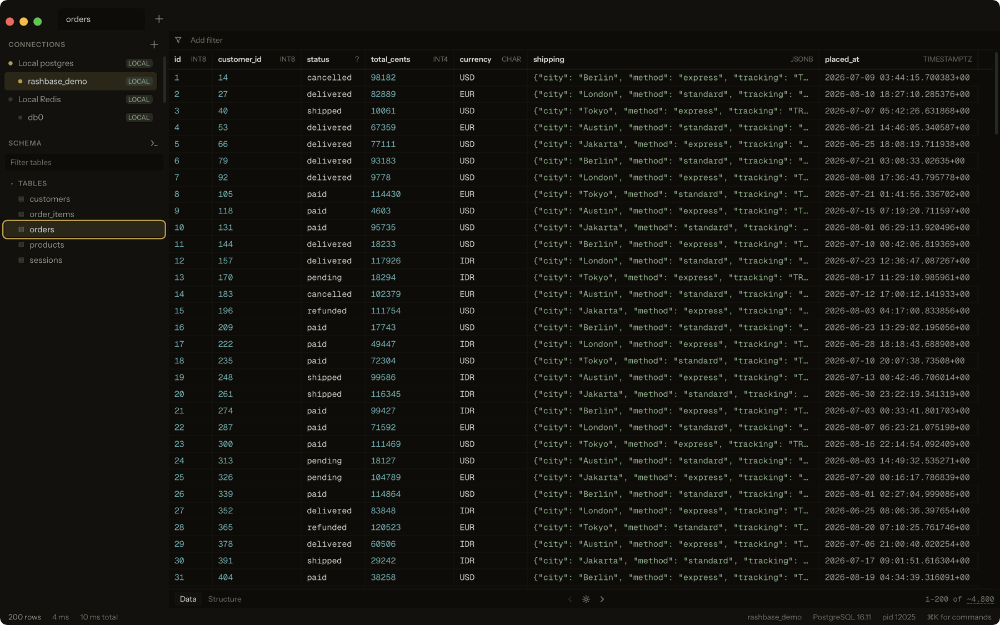
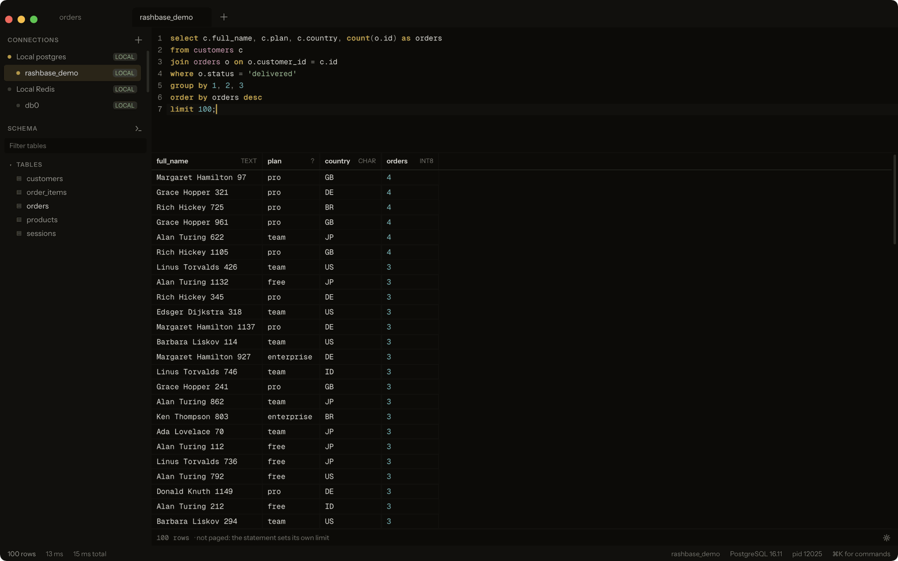
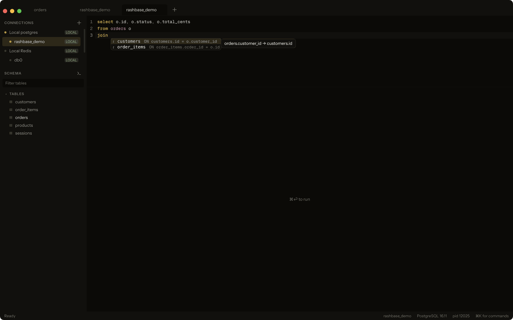
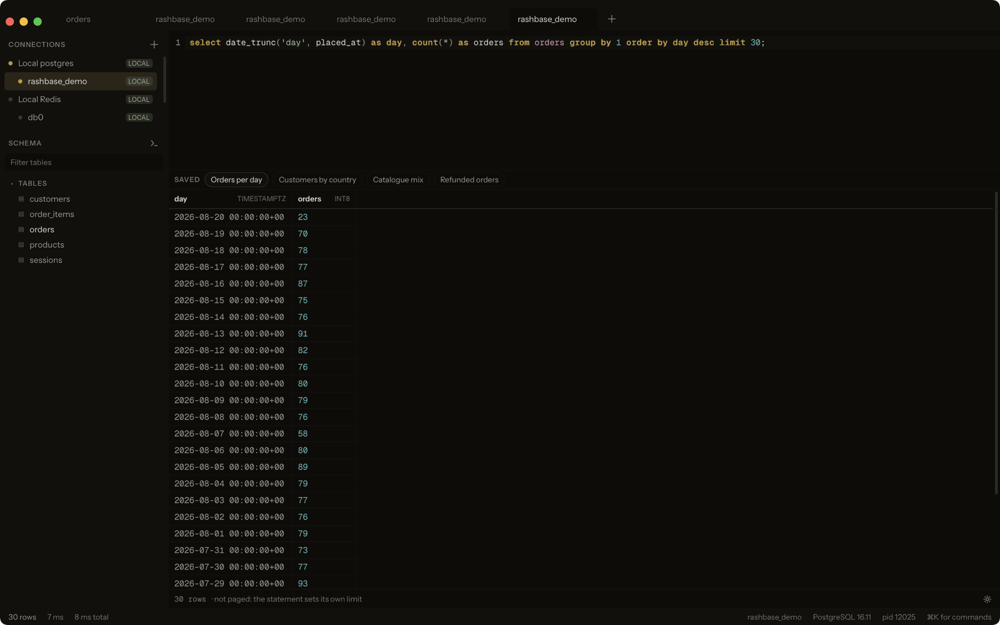
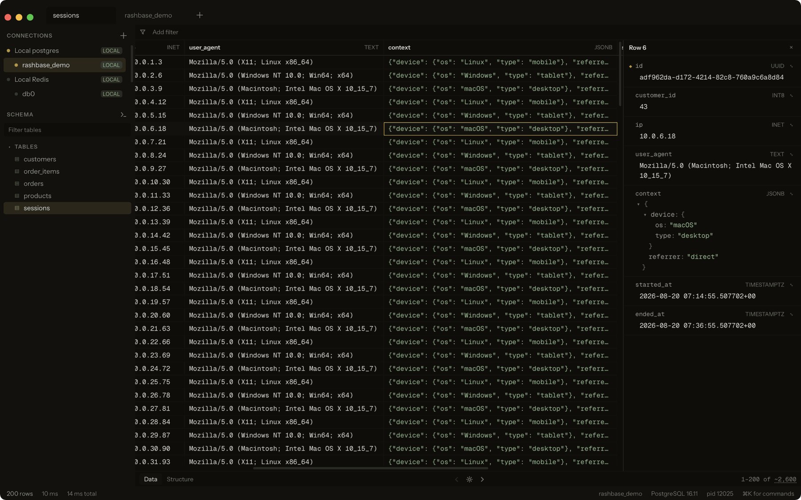
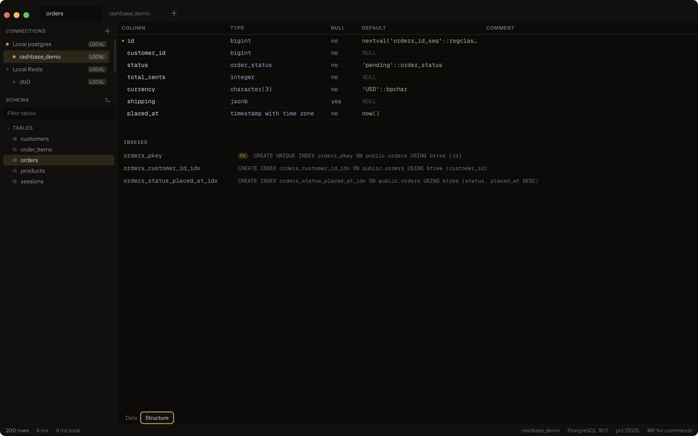
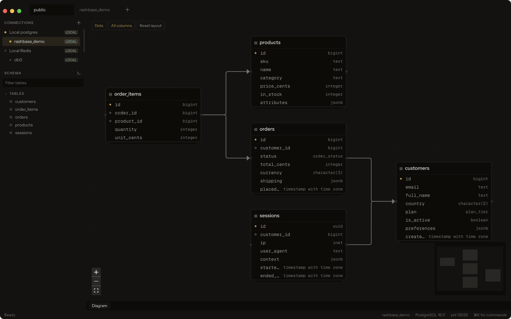
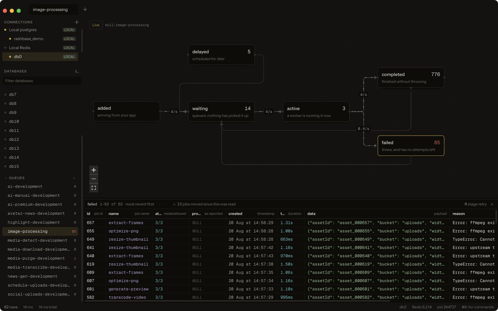

# Rashbase Studio

A free database client for macOS, Windows and Linux. Tauri v2, React 19, Rust.

No row limits, no seat pricing, no trial counter, no upsell banner. Connect,
browse, query, edit, ship.

## Why this exists

Every database client eventually asks for something. One caps the rows it will
show you. One puts export behind a plan. One charges per seat for a tool you use
alone. One is free but interrupts the work to remind you it could be paid. And
most of them make a simple thing — look at a table, run a query, fix one row —
take more clicks than it should.

Rashbase Studio is the opposite bet: every feature available to everyone, no
paywall anywhere in the app, and an interface dense enough that the data is the
only thing competing for attention. It is built for the developer who lives in a
database client for hours a day, switches between a local Docker Postgres and a
production replica in the same session, and wants the tool to disappear.

## Features

**Browse and edit**

- Virtualized result grid with column types in the header, row count and
  timings in the footer
- Inline cell editing, with the generated `UPDATE` shown before it runs
- Row detail panel: one row at full width, JSONB expanded as a tree
- Filter, sort and page any table; follow a foreign key to the row it names
- Staged row deletion — mark rows, read the statements, then commit or cancel
- Split view: two tabs side by side, with a draggable divider

**Query**

- CodeMirror 6 SQL editor that tells a keyword, a table and a column apart
- Schema-aware completion: `join` proposes real foreign keys and writes the
  `ON` clause; `where` proposes the columns already in scope, with their types
- Save a query to a chip under the editor; a dot marks one the editor has
  moved on from
- Export results to CSV, JSON or SQL

**Move a database**

- Export tables as SQL or CSV, one file or one per table, optionally gzipped. A
  safe export is written in restore order, guards every statement and upserts
  its rows, so it can be run into an empty database, into one that already
  holds part of it, or twice
- Import a `.sql` file — dropped on the window or chosen — from this app,
  TablePlus, pg_dump or anything else. What is in the file is read and counted
  before anything runs
- The import holds foreign keys until the end, so a dump written table by table
  loads whatever order its rows are in; skips statements naming roles that only
  exist on the server the dump came from; leaves an ORM's migration history to
  the database it is being imported into; and moves every identity sequence past
  the keys the dump carried, which is what stops the *application's* next insert
  from colliding
- One transaction. A statement the server refuses rolls back the whole file and
  is reported in the server's own words, with the line it was on

**Understand**

- Entity-relationship diagram built from the live catalogue
- Structure view: columns, defaults, nullability, indexes, comments

**Redis**

- Keyspace browsing in the same grid, filtered by prefix, glob or value
- TTL read as a duration, hashes opened as a JSON tree, string and field edits
- Staged key deletion and a raw command console
- BullMQ queues: the lifecycle drawn as a diagram with live counts and measured
  transition rates, job history per job, and retry with BullMQ's own script

**Connections**

- Connections grouped by environment, so a `PROD` connection never looks local
- A server connection lists every database the role can open
- SSH tunnelling with `known_hosts` enforced — no trust-on-first-use
- Passwords in the OS keystore, never in the webview
- Touch ID can gate a connection before its credential is read (macOS)

**The rest**

- Command palette and a hotkey for anything done more than twice a day
- Dark and light themes, four text sizes, window translucency
- Tabs remembered per connection, including filters and sort

## Gallery

<table>
  <tr>
    <td colspan="2" align="center">
      
      <br>
      <sub><b>Browse.</b> Connections grouped by environment, tables on the left, the grid taking everything else.</sub>
    </td>
  </tr>
  <tr>
    <td align="center" width="50%">
      
      <br>
      <sub><b>Query.</b> Keywords, relations and columns each read differently. Results land in the same grid.</sub>
    </td>
    <td align="center" width="50%">
      
      <br>
      <sub><b>Completion that reads the schema.</b> After <code>join</code>, the list is the table's own foreign keys — and it writes the <code>ON</code> clause.</sub>
    </td>
  </tr>
  <tr>
    <td align="center" width="50%">
      
      <br>
      <sub><b>Saved queries.</b> <code>⌘S</code> keeps a statement as a chip; the tab remembers which one it came from.</sub>
    </td>
    <td align="center" width="50%">
      
      <br>
      <sub><b>Row detail.</b> One row at full width, JSONB expanded in place.</sub>
    </td>
  </tr>
  <tr>
    <td align="center" width="50%">
      
      <br>
      <sub><b>Structure.</b> Columns, types, defaults and every index, as the catalogue states them.</sub>
    </td>
    <td align="center" width="50%">
      
      <br>
      <sub><b>Diagram.</b> <code>⌘D</code> lays out the schema from its own foreign keys.</sub>
    </td>
  </tr>
  <tr>
    <td colspan="2" align="center">
      
      <br>
      <sub><b>BullMQ queues.</b> The lifecycle with the exact count in each state and the measured rate on each edge. Clicking a state lists its jobs; a failed job stages and retries with <code>⌘S</code>.</sub>
    </td>
  </tr>
  <tr>
    <td align="center" width="50%">
      
      <br>
      <sub><b>Redis keyspace.</b> <code>key · type · ttl · size · value</code>, in the grid a table uses. TTL reads as a duration, not as <code>-1</code>.</sub>
    </td>
    <td align="center" width="50%">
      
      <br>
      <sub><b>Command console.</b> One command per line, one result set each, quotes honoured the way <code>redis-cli</code> honours them.</sub>
    </td>
  </tr>
</table>

## Databases

| Database | Status |
| --- | --- |
| PostgreSQL | Supported |
| Redis | Supported |
| MySQL / MariaDB, SQLite, SQL Server, ClickHouse, MongoDB, others | Not yet — see [CONTRIBUTING.md](CONTRIBUTING.md#adding-a-database) |

Postgres-wire-compatible servers (Supabase, Neon, Timescale, Yugabyte) connect
through the PostgreSQL driver. Redis-protocol servers (Valkey, KeyDB, Dragonfly)
connect through the Redis driver.

## Install

Prebuilt installers for every release are on the
[releases page](https://github.com/native-productions/rashbase-studio/releases).
The scripts below pick the right artifact for your platform.

**macOS and Linux**

```sh
curl -fsSL https://raw.githubusercontent.com/native-productions/rashbase-studio/main/scripts/install.sh | bash
```

**Windows**

```powershell
irm https://raw.githubusercontent.com/native-productions/rashbase-studio/main/scripts/install.ps1 | iex
```

### These builds are not signed

There is no Apple Developer or Windows code-signing certificate yet, so both
operating systems warn you the first time you open the app. The install scripts
handle macOS for you. If you downloaded an installer by hand:

- **macOS** — clear the quarantine flag once, after moving the app into
  `/Applications`:

  ```sh
  xattr -dr com.apple.quarantine "/Applications/Rashbase Studio.app"
  ```

- **Windows** — on the SmartScreen prompt, click **More info**, then **Run
  anyway**.
- **Linux** — nothing to do.

## Build from source

```sh
bun install
bun run app           # run it
bun run tauri build   # package it
```

Needs [Bun](https://bun.sh), Rust stable, and Xcode Command Line Tools on macOS.

`bun run app` runs under its own bundle identifier, so a build from source keeps
its connections, preferences and saved passwords separate from an installed copy
of the app. You can run both at once.

## Contributing

Bug reports, drivers and features are welcome. [CONTRIBUTING.md](CONTRIBUTING.md)
has the setup, the layout, the tests, and the four invariants a change must not
break.

## Not built yet

Inserting rows, query history, and the AI layer. Windows Hello and a Linux
equivalent of Touch ID. On queues: removing and promoting jobs, and a
configurable key prefix.

## Documentation

- [CHANGELOG.md](CHANGELOG.md) — what changed, release by release
- [PRODUCT.md](PRODUCT.md) — what this is and who it is for
- [DESIGN.md](DESIGN.md) — the design system
- [AGENTS.md](AGENTS.md) — instructions for AI agents working in this repository

## License

[PolyForm Noncommercial 1.0.0](LICENSE). Permitted: personal use, study, hobby
projects, research, and use by nonprofits, schools and government. Not
permitted: any commercial purpose, which includes selling it, running it as part
of a paid product or service, and forking it into a commercial product.

This is source-available, not open source: the noncommercial restriction
discriminates against a field of use, so it does not meet the OSI definition.
